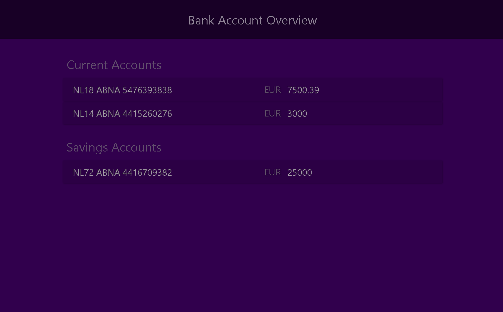
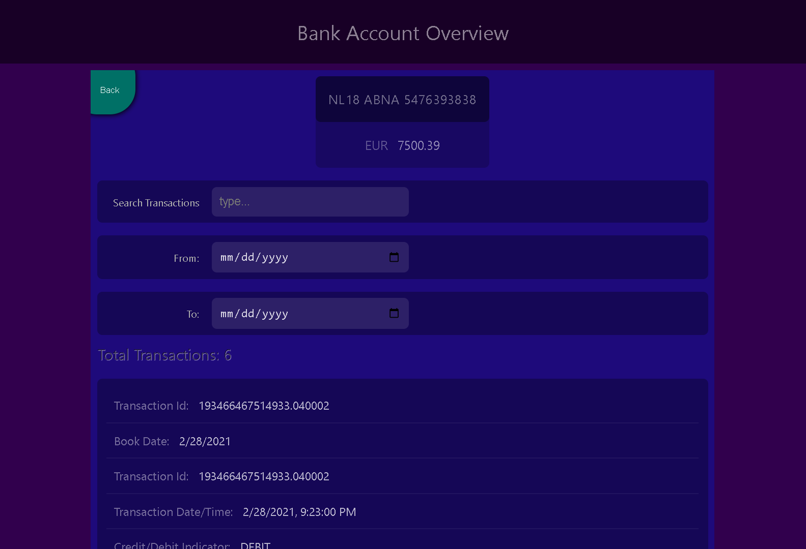

# Bank Account Dashboard

Is a mini Vue3 application applies most of the basic/common Vue concepts, uses vue-router for routing, vitest & testing-library/vue for unit testing, & styled with plain css & sass.

## Demo Screenshots: (Click an img to navigate to the live app)

---

---
### App Requirements

- ❖ Make a mocked service call that returns the contents of the
accounts JSON found in Appendix A of this file.
- ❖ Show a list of the accounts returned in the step above.
- ❖ Should allow the user to drill-down into the account to see more
details.
- ❖ When drilling down on an account: make a mocked service call for
the respective account and return the correct transactions. The
transactions can be found in Appendices B, C and D respectively.
- ❖ Transaction history in the account drill-down view.
- ❖ Stretch: A Transactions Search (by name or any other detail).
- ❖ Stretch: Filter transactions by date.
---

### Prerequisites & Major steps taken along the development

- Read thoroughly to understand the assignment & make sure everything is a crystal clear
- Translate & sort the requirements into small & feasible tasks in a logical order
- Created Vue app using [vite](https://vitejs.dev/guide/#:~:text=warns%20about%20it.-,With%20NPM%3A,-bash)
- Cleaned up the files & renamed the main title.
- Created this repository & pushed my first commit
- Add the mocked data
- Created a `general checklist` per each task (later section below)
- Created app `acceptance criteria` (later section below)
---

### General Checklist per Task

1. Describe each subtask with its acceptance criteria
2. Create a separate branch  
2.1.  Prioritise the functionality & testing  
2.2.  Write a clean & a testable code  
2.3.  Add unit-testing  
2.4.  Update the Todo-List in the README.md file with what’s needed to
be done later  
2.5.  Report bugs & fix as per necessity
3. Create a descriptive Pull-Request
4. Merge to master
---

### App Acceptance Criteria

1. Written in JavaScript, but a plus if it’s in TypeScript;
2. No use of UI libraries like Bootstrap or Vuetify, only use css/scss;
3. Exceptions to the above are libraries that are used for icons,
charts, calendars / search buttons etc. As long as it’s used for a dedicated part of the UI / a functionality and not to style the whole
app;
4. Cover the project with unit tests (you are free to choose a unit test
tool)
---

### Conventions Followed

- [Naming Branches](https://codingsight.com/git-branching-naming-convention-best-practices/)
- [Writing Commits](https://gist.github.com/robertpainsi/b632364184e70900af4ab688decf6f53)
---

### What would I have done differently if I had enough time

- Create a Cypress Project & implement the E2E testing
---

### What would I have done differently if I had the chance to start over

- I'd write the unit test right away in parallel with each & every file I'm working on
---
---
# Vue 3 + TypeScript + Vite

This template should help get you started developing with Vue 3 and TypeScript in Vite. The template uses Vue 3 `<script setup>` SFCs, check out the [script setup docs](https://v3.vuejs.org/api/sfc-script-setup.html#sfc-script-setup) to learn more.

## Recommended IDE Setup

- [VS Code](https://code.visualstudio.com/) + [Volar](https://marketplace.visualstudio.com/items?itemName=Vue.volar) (and disable Vetur) + [TypeScript Vue Plugin (Volar)](https://marketplace.visualstudio.com/items?itemName=Vue.vscode-typescript-vue-plugin).

## Type Support For `.vue` Imports in TS

TypeScript cannot handle type information for `.vue` imports by default, so we replace the `tsc` CLI with `vue-tsc` for type checking. In editors, we need [TypeScript Vue Plugin (Volar)](https://marketplace.visualstudio.com/items?itemName=Vue.vscode-typescript-vue-plugin) to make the TypeScript language service aware of `.vue` types.

If the standalone TypeScript plugin doesn't feel fast enough to you, Volar has also implemented a [Take Over Mode](https://github.com/johnsoncodehk/volar/discussions/471#discussioncomment-1361669) that is more performant. You can enable it by the following steps:

1. Disable the built-in TypeScript Extension
   1. Run `Extensions: Show Built-in Extensions` from VSCode's command palette
   2. Find `TypeScript and JavaScript Language Features`, right click and select `Disable (Workspace)`
2. Reload the VSCode window by running `Developer: Reload Window` from the command palette.
